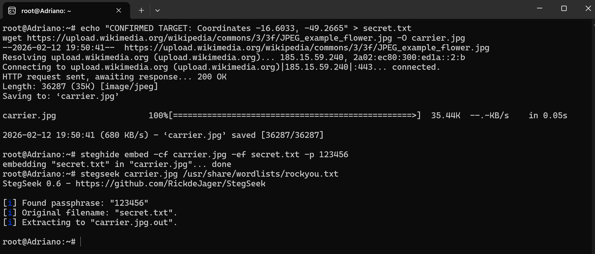

# 🕵️‍♂️ forensics-steganography-lab

Digital Forensics Case Study: Data embedding and password recovery using Steghide & Stegseek. 🕵️‍♂️🔒

---

## 🚀 Step-by-Step Implementation

### 1. Environment Setup
First, we update the system and install the forensic toolkit: **Steghide** (to hide data), **Stegseek** (to crack passwords), and **Bat** (for colorful terminal output).

```bash
sudo apt update && sudo apt install steghide stegseek bat -y
2. The Injection (Embedding Data)
In this phase, we create a secret text file and embed it into a standard JPEG image using a password.

Bash
# Create the secret message
echo "CONFIRMED TARGET: Coordinates -16.6033, -49.2665" > secret.txt

# Embed the secret into the carrier image
steghide embed -cf carrier.jpg -ef secret.txt -p 123456
3. The Forensic Attack (Cracking)
We simulate a forensic investigation where the password is unknown. We use Stegseek with a dictionary attack (rockyou.txt) to recover the secret.

Bash
stegseek carrier.jpg /usr/share/wordlists/rockyou.txt
4. Evidence Display (Final Report)
After successfully cracking the protection, we display the recovered evidence using a formatted and colorful output.

Bash
batcat --style=full --color=always carrier.jpg.out
🧠 Forensic Insights
Data Persistence: Even if a file is hidden, its bit-patterns leave traces that forensic tools can detect.

Password Strength: Simple passwords (like 123456) offer zero protection against modern brute-force tools.

Integrity: Digital forensics is about uncovering the truth hidden in plain sight.



⚠️ Disclaimer
This project is for educational purposes only. All techniques were performed in a controlled environment for cybersecurity research.
